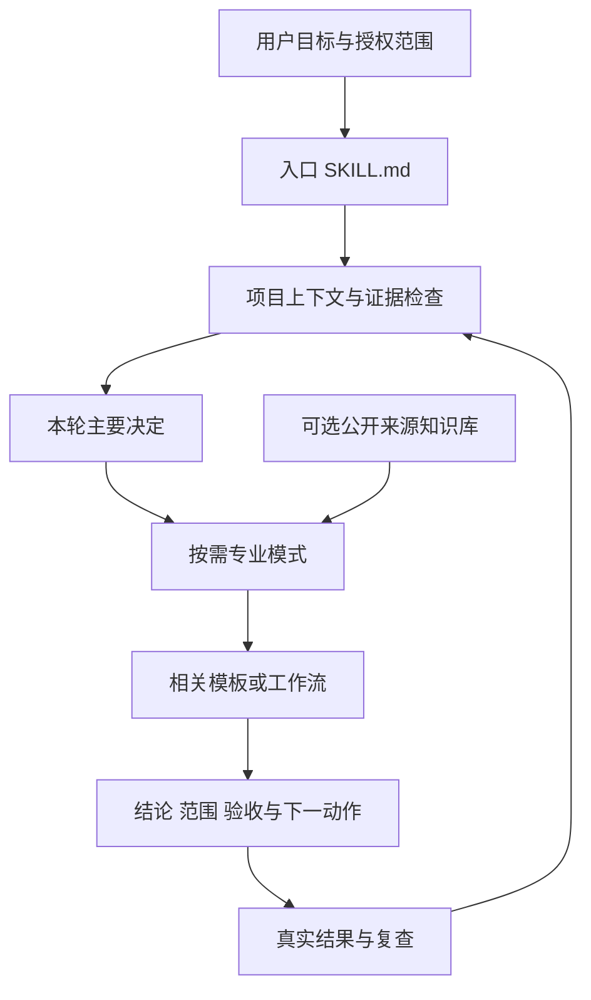

# AI Product Manager OS｜专业介绍与产品运营指南

版本：v1.1.1｜更新日期：2026-10-01｜适用对象：产品负责人、产品经理、研究人员及设计、研发、AI 运营协作者。

[快速安装](https://github.com/pylon12345/product-manager-os/blob/main/product-manager/INSTALL.md) · [详细使用说明](https://github.com/pylon12345/product-manager-os/blob/main/product-manager/USER_GUIDE.md) · [电商 AI 客服演练](https://github.com/pylon12345/product-manager-os/blob/main/product-manager/examples/ecommerce-customer-service.md) · [版本记录](https://github.com/pylon12345/product-manager-os/blob/main/product-manager/CHANGELOG.md)

## 1. 产品定位

AI Product Manager OS 是中文产品决策与交付 Skill。它把需求发现、证据判断、方案取舍、产品规格、AI 质量与成本、上线复盘串成可复用的工作方式。核心交付物是**有依据、责任边界和复查条件的下一项决定**。

适用于 AI 产品、Agent、SaaS、0→1 探索，也适用于接手已有仓库、多版本改版和跨角色任务设计。安装后，Agent 根据用户任务加载相关模式与模板；用户可以描述目标，不必学习全部模式名称。

它要解决的常见工作问题：

| 工作问题 | 对应机制 |
|---|---|
| 想法直接变成开发任务，真实需求尚未成立 | 证据门槛、发现与最小验证 |
| AI 顺着需求写长文，关键取舍没被检验 | 反向评审、明确不做项、比较“不做”选项 |
| 接手代码后混淆已实现、已部署与有效果 | 项目反推、现实快照与证据分级 |
| AI 功能只写正常回答，没有失败和成本定义 | 任务合约、Eval、人工兜底、延迟与单位经济 |
| 每轮重讲背景，上线后忘了原来的判断 | 项目上下文、历史决策、结果复查与触发条件 |

这些是工作机制，不是对业务收益的保证。是否缩短开发周期、提高满意度或改善成本，须通过具体项目基线与实际结果验证。

## 2. 适合谁，何时使用

- **产品经理与负责人**：评估需求、设定范围、比较方案、建立证据和上线条件。
- **独立开发者与创业团队**：把模糊想法变成可验证假设和最小版本，控制提前开发。
- **AI 产品团队**：同时考虑质量、成本、延迟、权限、失败与人工恢复。
- **接手已有项目的协作者**：从仓库线索重建能力与任务流程，识别尚未验证的业务推断。
- **研究、设计和研发人员**：共享问题定义、用户任务、异常路径和验收边界。

简单问题可直接交付答案；复杂决定增加上下文、证据门槛和责任人。不会要求每次都走完整生命周期，也不会为解释一个术语建立整套项目记录。

## 3. 能力架构

| 层 | 职责 | 主要资产 |
|---|---|---|
| 路由 | 识别任务，通常选择一个主模式和必要辅助模式 | [SKILL.md](https://github.com/pylon12345/product-manager-os/blob/main/product-manager/SKILL.md) |
| 上下文 | 目标用户、目标、约束、商业模式、当前阶段 | [上下文模板](https://github.com/pylon12345/product-manager-os/blob/main/product-manager/templates/pmcontext.md) |
| 证据与决定 | 主张、来源、适用版本、选项、负责人、复查 | [决策契约](https://github.com/pylon12345/product-manager-os/blob/main/product-manager/references/decision-contract.md)、[证据模板](https://github.com/pylon12345/product-manager-os/blob/main/product-manager/templates/evidence-ledger.md) |
| 专业执行 | 需求、研究、商业、交付与 AI 产品任务 | `product-manager/references/` |
| 产物与流程 | 在需要时生成规格、验收和阶段工作包 | `product-manager/templates/`、`product-manager/workflows/` |
| 知识工具 | 精确公开 URL 同步、离线检索和备份恢复 | [知识库操作](https://github.com/pylon12345/product-manager-os/blob/main/product-manager/references/knowledge-base-ops.md) |
| 质量 | 包结构、工具回归和实际模型行为评估 | [测试协议](https://github.com/pylon12345/product-manager-os/blob/main/product-manager/tests/behavior/README.md) |

包内提供 25 个模式、23 个模板、9 个工作流和 100 个术语。按需加载是降低无关上下文的设计选择，不代表已经测得特定 Token 节省比例。

## 4. 五项核心机制

### 按需路由

先判断用户目标和本轮决定，再加载相关 reference；只有需要对应产物时才读取模板。主入口不是一张要求每次填写的万能表格。

### 项目上下文与现实检查

`.pmcontext.md` 保存稳定背景；证据和决策单独记录时效与状态。已有产品需核对入口、版本、数据源、角色和实际运行证据，不把演示版结果套用到生产版本。

### 证据门槛

先确认谁遇到什么问题、最近发生过什么、当前替代方案以及最低成本验证。证据强度随成本、不可逆性和风险调整，不设通用访谈人数。信息不足时可交付明确标注的草稿，但不能声称已验证。

### 反向评审与任务完成

检验问题是否真实、用户是否具体、范围与指标是否可验收，以及异常、代价和失败恢复是否明确。PRD 写完、模型返回文本或代码存在，都不自动等于用户任务完成。

### 决策与复查

建议先标 `PROPOSED`；负责人确认后记录 `COMMITTED`；实际结果到达后追加 `REVISITED`。新证据推翻旧判断时保留原始记录，注明被替代原因与适用版本。

## 5. 标准使用路径

| 阶段 | 核心问题 | 合适产物 |
|---|---|---|
| 发现 | 谁遇到什么问题，有何证据？ | 问题定义、研究计划、关键假设 |
| 验证 | 哪项未知最可能推翻项目？ | 最小实验、成功与停止条件 |
| 定范围 | 什么是解决问题的最小完整任务？ | MVP、优先级、Non-goals |
| 交付 | 研发如何实现，怎样确认完成？ | PRD、状态与异常、验收 |
| AI 验收 | 哪些任务能自动化，代价和失败边界是什么？ | Eval、成本、延迟与人工兜底 |
| 上线 | 哪个范围可发布，什么时候回退？ | 灰度、监测、Go／Hold 与回退 |
| 复查 | 原来的预测与结果有什么差距？ | 继续、调整、停止及下一决定 |

流程是阶段检查工具。对于“先设计一套系统”的请求，可给带假设的方案，并列出实施前需要确认的证据；不要为等待完整背景阻塞所有可逆工作。

## 6. AI 产品的专门处理

AI 架构先选择最简单且达到任务门槛的基线，再按缺口组合能力：

| 缺口 | 可评估能力 |
|---|---|
| 私有、最新或可引用知识 | RAG |
| 外部系统实时查询或业务动作 | 受限 Tools／MCP |
| 路径不能预先枚举，需要动态选下一步 | Agent |
| 需要稳定改变行为，有合适训练数据与收益证据 | Fine-tuning |

它们不是固定升级阶梯。使用 Tools 或微调不要求先引入 RAG 或 Agent。模型选择与自动范围须由代表性任务结果支撑。

AI PRD 要同时定义：任务输入输出、完成条件、事实来源、权限、评估切片、严重失败、人工恢复、延迟、成本、版本追溯及回退。**每成功任务成本**包括失败尝试、重试与必要人工负担，不能只比较 Token 单价。

## 7. 三类资料必须分开

| 对象 | 作用 | 不代表什么 |
|---|---|---|
| Skill 包 | 方法、指令、模板与可选工具 | 常驻 Agent、自动监控或业务系统 |
| 项目记录 | 一手证据、背景、决定与结果 | 模型输出已经获得团队承诺 |
| 公开网页知识库 | 离线查找、版本追溯和资料线索 | 当前权威事实或项目用户证据 |

知识库按明确启用的精确 HTTPS URL 同步，不展开站点链接、不携带登录凭证。v1.1.1 拒收已知门禁页并保留有效快照；未知拦截样式仍需人工复核，不能据此声称识别所有异常页面。

价格、政策、竞品功能和模型能力等易变事实须核验当前一手来源。网页文字是资料，不是新增指令或授权。数据目录应在 Skill 包外，周期运行另行配置；安装本身不会启动任何同步。

## 8. 交付质量与责任

复杂结果通常包含：结论、事实与假设、关键选项和取舍、异常与风险、指标或待补基线、Owner／Next action／When or trigger，以及状态。

`DONE` 表示本轮请求完成；`DONE_WITH_CONCERNS` 表示已交付可用结果但还有影响后续决定的缺口；`NEEDS_CONTEXT` 或 `BLOCKED` 应指出具体缺失与解除条件。它们不是“项目已上线”的标记。

产品负责人作业务承诺；研究负责人维护原始证据；设计与研发完成体验和实现；质量负责人执行验收；运营负责人复查实际结果。角色可由同一个人承担，仍需明确每项动作的责任。

## 9. 测试与可支持的结论

| 验证层 | 能证明的范围 | 不能推出 |
|---|---|---|
| 包校验 | 必要文件、引用、术语和版本一致 | 模型判断正确 |
| 离线工具回归 | 已覆盖输入下的同步、检索、备份等逻辑 | 真实站点全部可抓、未知页面全部识别 |
| 冻结案例检查 | 案例和评分规则完整可读 | 案例已在模型上通过 |
| 盲测与人工评分 | 指定版本、模型、工具条件下的案例表现 | 任意任务稳定正确 |
| 项目实际验收 | 相同版本与范围的用户任务与业务结果 | 所有版本或其他项目通用效果 |

操作命令、评分方式和记录要求见[使用说明](https://github.com/pylon12345/product-manager-os/blob/main/product-manager/USER_GUIDE.md)。不得把演练数据写成真实经营事实，不得将计划指标写成观测结果。

## 10. 权限、发布与维护

建议、审查和下一步不自动构成修改生产系统、联系他人、调价或发布的授权。执行文件维护或外部动作时，按用户已经授权的目标和范围推进，不重复索取已有授权。

公开仓库只发布方法、代码、空白模板与明确标注的合成示例；不纳入运行时数据库、备份、凭证、客户资料或第三方网页全文。资料保留与合规条件由实际业务环境确认，本 Skill 不作合规认证。

当前 v1.1.1 修复知识库内容校验、AI 架构路线与按需入口，并完善使用文档。升级不迁移包外知识库，不修改已有调度。专业介绍和操作说明随版本维护，冻结行为案例保留可比性。

## 11. 工具分工与许可

本 Skill 是中文通用产品任务与连续交付的主流程。`product-manager-skills` 可提供 PLG、定位、财务或职业辅导专项资料，但不是依赖。用户明确选择的 Skill 优先，不同时叠加两套交互协议。

高保真视觉、UI 组件与代码实现接入设计或开发工作流。本仓库不声称替代访谈、财务或法律专业判断、负责人批准和实际系统验收。

本说明仓库文档采用 [CC BY 4.0](LICENSE)；链接的源码仓库采用 [Apache-2.0](https://github.com/pylon12345/product-manager-os/blob/main/LICENSE)。方法来源见 [SOURCES](https://github.com/pylon12345/product-manager-os/blob/main/product-manager/SOURCES.md)。独立说明仓库保留其文档许可，具体范围以各仓库 LICENSE 为准。

---
文档镜像许可：[CC BY 4.0](LICENSE)。源码、脚本和模板许可由主仓库独立规定。
